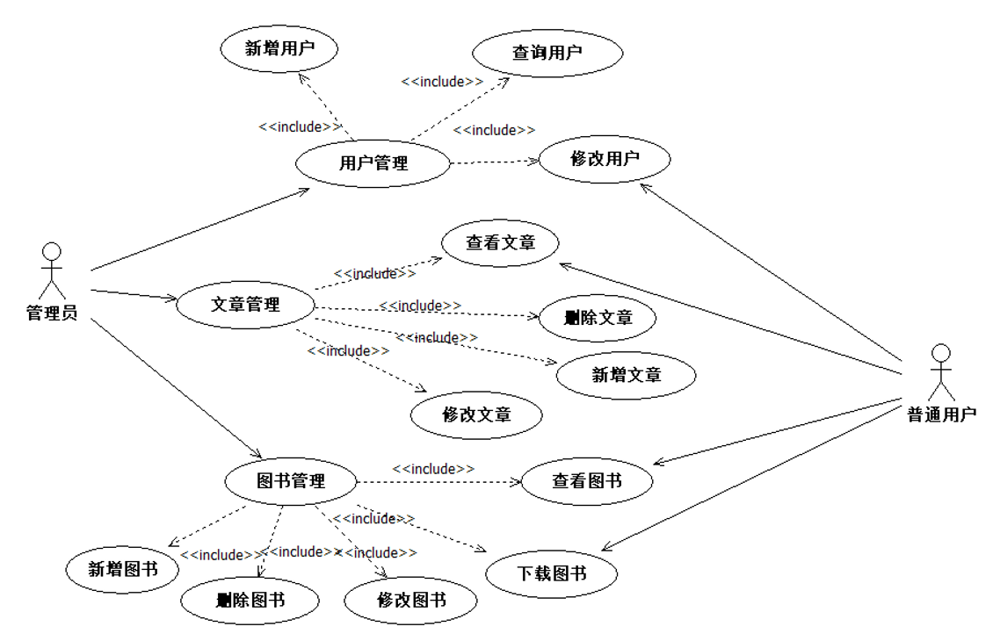
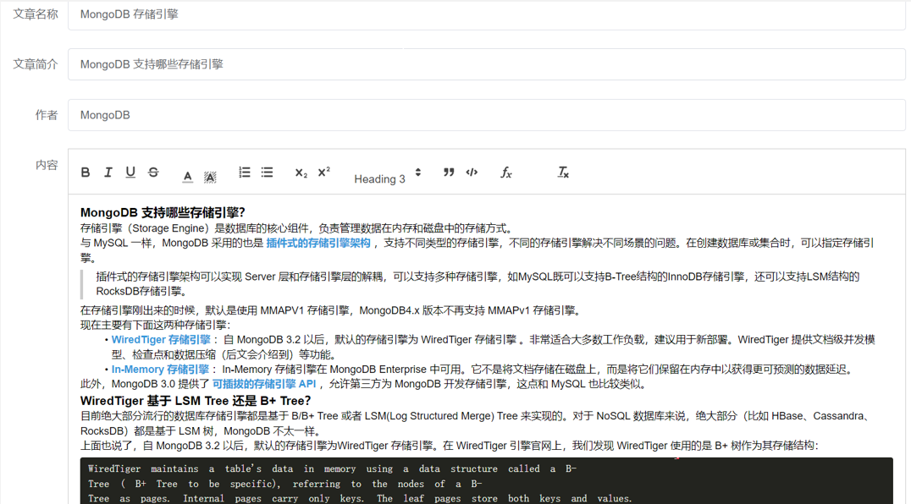
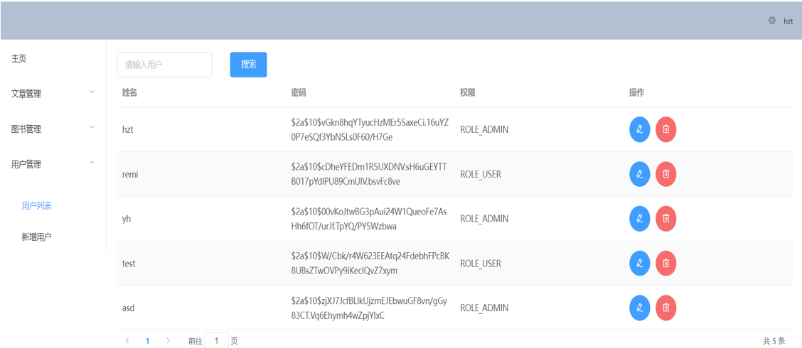

# 1    系统分析

## 1.1  功能描述

 

图 1‑1功能模块图

图书管理系统根据功能划分如图 1‑1所示，本系统详细功能需求描述如下。

1.   登录与注册

在网站首页登录，根据用户权限不同，登录后进入的界面和享有的功能不同。可以进行注册用户和修改密码。

2.   前端页面

1)   文章管理

用户可以在该功能中查看文章信息列表，也可查看对应文章的详细内容。

2)   图书管理

用户可以在该功能中查看图书信息，并下载图书文件。

3.   后端管理页面

1)   用户管理功能

管理员可以在该功能中新增、修改、删除用户信息，以及根据关键字搜索用户信息。

2)   文章管理功能

管理员可以在该功能中新增、修改、删除文章信息，以及根据关键字搜索文章信息

3)   图书管理功能

管理员可以在该功能中新增、修改、删除图书信息和下载图书文件，以及根据关键字搜索图书信息。

## 1.2  用例分析说明

   

图 1‑2登录与注册用例图

管理员可以对文章、用户和图书进行管理。

普通用户只能查看文章、图书和对自己用户进行管理。

   

图 1‑3 功能用例图

 

# 2    系统设计

## 2.1  活动图

普通用户使用系统的活动图，包含查看文章、查看图书和下载图书以及修改密码。如图 2‑1所示。

图 2‑1普通用户活动图

管理员的系统的活动图，图书管理活动图如图 2‑2所示，文章管理活动图如图 2‑3所示，用户管理活动图如图 2‑4所示。

|  |  |  |
| :----------------------------------------------------------: | :----------------------------------------------------------: | :----------------------------------------------------------: |
|                     图 2‑2图书管理活动图                     |                     图 2‑3文章管理活动图                     |                     图 2‑4用户管理活动图                     |

# 3    系统实现

在实现过程中，我使用Spring Boot作为后端框架，通过MongoDB存储；前端使用Vue实现，通过Axios与后端进行交互。下面简要介绍几个关键实现的方面：

## 3.1  后端实现

后端采用了Spring Boot框架，并选择了MongoDB数据库进行数据存储。在处理请求时，我们使用了Spring MVC模式，定义了具体的Controller与Service，通过Spring Data MongoDB提供的Repository进行数据存储和查询。使用Redis对数据进行缓存。此外，为了提高系统的安全性，还使用了Spring Security框架，通过JWT实现了登录验证功能。

## 3.2  前端实现

前端采用了Vue框架，使用Axios与后端进行交互。在实现过程中，我们使用了Vue Router实现了路由控制，并使用了Element UI进行页面布局和组件的使用。

## 3.3  数据库设计

本项目业务所需的数据表主要包括：用户表、图书表和文章表。该项目所涉及的3张表的具体结构，分别如表 3-1至表 3-3所示。

表 3-1图书表book

| 字段名    | 类型   | 是否为主键 | 说明                |
| --------- | ------ | ---------- | ------------------- |
| id        | String | 是         | 图书id              |
| bookname  | String | 否         | 图书名称            |
| bookbrief | String | 否         | 图书简介            |
| author    | String | 否         | 图书作者            |
| filename  | String | 否         | 图书文件名称        |
| filetype  | String | 否         | 图书文件类型        |
| fileId    | String | 否         | 存储MongoDB的文件id |

表 3-2文章表novel

| 字段名     | 类型   | 是否为主键 | 说明         |
| ---------- | ------ | ---------- | ------------ |
| id         | String | 是         | 文章id       |
| novelname  | String | 否         | 文章名称     |
| novelbrief | String | 否         | 文章简介     |
| author     | String | 否         | 文章作者     |
| opentime   | String | 否         | 文章上传时间 |
| content    | String | 否         | 文章详细内容 |

表 3-3用户表user

| 字段名   | 类型   | 是否为主键 | 说明     |
| -------- | ------ | ---------- | -------- |
| id       | String | 是         | 用户id   |
| username | String | 否         | 用户名   |
| password | String | 否         | 密码     |
| ole      | String | 否         | 用户权限 |

 

## 3.4  项目效果

以下是本项目的主要页面预览效果

前台图书预览效果，如图 3‑1所示。在图书页面中，展示出图书的详情，并可下载图书，如图 3‑2所示。

 

图 3‑1前台图书预览效果

   

图 3‑2图书下载效果

前台文章预览效果。在文章页面中，展示出文章信息，如图 3‑3所示。点击操作可以查看文章详细内容，如图 3‑4所示。

图 3‑3前台文章预览效果 

图 3‑4前台文章内容预览效果 

后台图书预览效果。在图书页面中展示出图书信息，如图 3‑5所示。新增图书信息，如图 3‑6所示。

图 3‑5后台图书预览效果 

图 3‑6图书新增预览效果 

后台文章预览效果，在文章页面中展示出文章信息，如图 3‑7所示。新增文章信息，如图 3‑8所示。

图 3‑7后台文章预览效果 

图 3‑8文章新增预览效果 

用户管理预览效果，在用户页面中展示出用户信息，如图 3‑9所示。新增用户信息，如图 3‑10所示。

图 3‑9用户管理预览效果 

图 3‑10用户新增管理新增效果 

